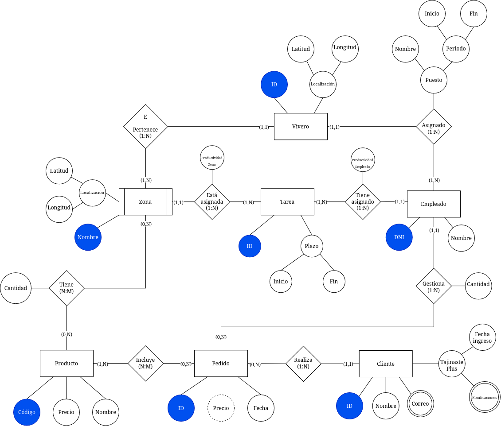
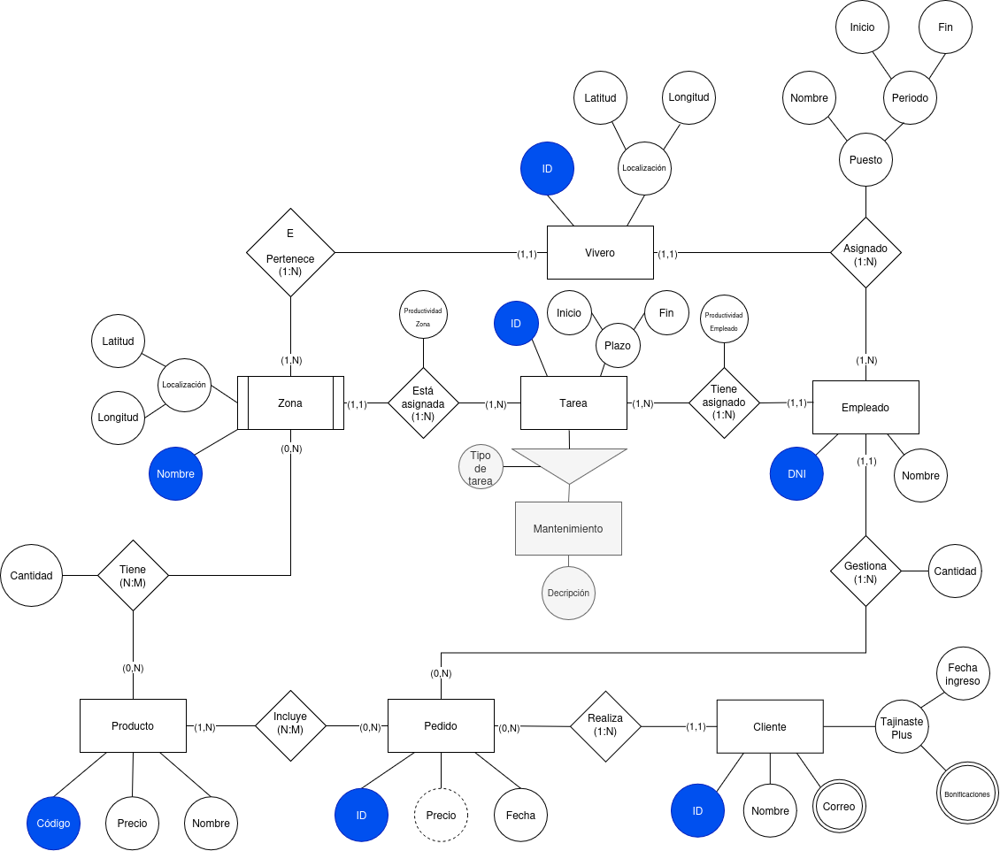

# Práctica 2: modelo entidad/relación de Tajinaste S.A.

## Autores

- Sergio Ávila González.
- Kyrylo Chvanov.

## Descripción

El modelo representa los viveros de Tajinaste S.A., sus zonas y los productos disponibles en ellas.
También recoge los empleados y sus tareas, los pedidos de los clientes y la información del programa Tajinaste Plus.

El diagrama:
.

Modificación:
.

## 1. Entidades

| Entidad | Descripción |
|---|---|
| Vivero | Cada establecimiento de la empresa y su localización. |
| Zona | Un espacio de un vivero, como el exterior o el almacén. Depende de la existencia de su vivero. |
| Producto | Cada producto del catálogo que puede estar disponible en las zonas. |
| Empleado | Cada trabajador de la empresa, que tiene un vivero de destino y realiza tareas. |
| Tarea | Cada tarea que se asigna a los empleados. Sus fechas permiten conservar el historial. |
| Cliente | Cada cliente, con su contacto e información de pertenencia a Tajinaste Plus. |
| Pedido | Cada compra realizada por un cliente y gestionada por un empleado. |

## 2. Atributos de las entidades y sus dominios

### Vivero

| Atributo | Descripción y dominio |
|---|---|
| ID | Identificador. Entero positivo. |
| Localización | Atributo compuesto por latitud y longitud, en grados decimales. |
| Latitud | Decimal |
| Longitud | Decimal |

### Zona

| Atributo | Descripción y dominio |
|---|---|
| Nombre | Identificador marcado en el diagrama. Texto no vacío y único en el modelo. |
| Localización | Atributo compuesto por latitud y longitud. |
| Latitud | Decimal |
| Longitud | Decimal |

### Producto

| Atributo | Descripción y dominio |
|---|---|
| Código | Identificador. Texto alfanumérico no vacío y único. |
| Nombre | Texto no vacío que describe el producto. |
| Precio | Precio del producto individual. |

### Empleado

| Atributo | Descripción y dominio |
|---|---|
| DNI | Identificador. Texto con ocho cifras y una letra de control válida. |
| Nombre | Texto no vacío con el nombre del empleado. |

### Tarea

| Atributo | Descripción y dominio |
|---|---|
| ID | Identificador. Entero positivo. |
| Plazo | Atributo compuesto que recoge el intervalo mediante Inicio y Fin. |
| Inicio | Fecha válida de comienzo. |
| Fin | Fecha posterior a Inicio, o vacía mientras la tarea siga abierta. |

### Cliente

| Atributo | Descripción y dominio |
|---|---|
| ID | Identificador. Entero positivo. |
| Nombre | Texto no vacío con el nombre del cliente. |
| Correo | Atributo multivaluado: varios correos con formato válido. |
| Tajinaste Plus | Atributo compuesto con Fecha ingreso y Bonificaciones. Se interpreta que está ausente si el cliente no pertenece al programa. |
| Fecha ingreso | Fecha de incorporación al programa. Sólo corresponde a clientes Plus. |
| Bonificaciones | Atributo multivaluado que contiene bonificaciones del cliente Plus. |

### Pedido

| Atributo | Descripción y dominio |
|---|---|
| ID | Identificador. Entero positivo. |
| Fecha | Fecha válida en la que se realiza el pedido. |
| Precio | Precio del pedido. Se calcula sumando los precios de todos los productos individuales. |

## 3. Relaciones y cardinalidades

| Relación | Cardinalidad y participación en ambos sentidos |
|---|---|
| Vivero - Pertenece - Zona | 1:N. Una zona pertenece a 1 vivero. Un vivero tiene 1 a N zonas. La letra E indica dependencia de existencia: una zona necesita su vivero para existir. |
| Zona - Tiene - Producto | N:M. Una zona tiene 0 a N productos. Un producto puede estar en varias zonas (0 a M). |
| Vivero - Asignado - Empleado | 1:N. Un empleado está destinado a 1 vivero. Un vivero tiene 1 a N empleados. Se interpreta como el destino actual. Contiene atributo compuesto `Puesto` |
| Zona - Tiene - Tarea | 1:N. Cada tarea se realiza en 1 zona. Una zona tiene 1 a N tareas. Incluye Productividad Zona. |
| Empleado - Tiene - Tarea | 1:N. Cada tarea corresponde a 1 empleado. Un empleado tiene 1 a N tareas. Incluye Productividad Empleado. |
| Pedido - Incluye - Producto | N:M. Un pedido incluye 1 a N productos. Un producto aparece en 0 a N pedidos. |
| Cliente - Realiza - Pedido | 1:N. Cada pedido pertenece a 1 cliente. Un cliente realiza 0 a N pedidos. |
| Empleado - Gestiona - Pedido | 1:N. Cada pedido tiene 1 empleado responsable. Un empleado gestiona 0 a N pedidos. Incluye Cantidad. |

El historial de destinos se interpreta a través de `Empleado - Tarea - Zona - Vivero`, utilizando Inicio y Fin de cada tarea.

## 4. Atributos de las relaciones

| Relación | Atributo | Descripción y dominio propuesto |
|---|---|---|
| Zona - Tiene - Producto | Cantidad | Stock de ese producto en esa zona. Entero no negativo. |
| Zona - Tiene - Tarea | Productividad Zona | Rendimiento de la zona asociado a esa tarea. Se propone un decimal no negativo en unidades por hora. |
| Empleado - Tiene - Tarea | Productividad Empleado | Rendimiento del empleado asociado a esa tarea. Se propone un decimal no negativo en unidades por hora. |
| Empleado - Gestiona - Pedido | Cantidad | Se interpreta como las unidades de producto gestionadas en ese pedido. Entero positivo. |

El enunciado no define la medida de productividad ni el significado concreto de Cantidad en Gestiona. Estas interpretaciones fijan su dominio para la entrega. Las productividades se registran para el periodo de la tarea correspondiente.

## 5. Restricciones semánticas

1. **Dependencia:** toda zona pertenece a un vivero.
2. **Un destino simultáneo:** un empleado no puede trabajar en dos viveros a la vez.
3. **Destino actual:** las tareas vigentes del empleado deben realizarse en zonas de su vivero actual.
4. **Fechas:** Inicio es anterior a Fin.
5. **Responsabilidad:** cada pedido tiene exactamente un empleado responsable.
6. **Ingreso en Plus:** sólo se utilizan para campañas y bonificaciones los pedidos con fecha igual o posterior a fecha ingreso.
7. **Bonificaciones:** se asignan según las compras de cada mes.

